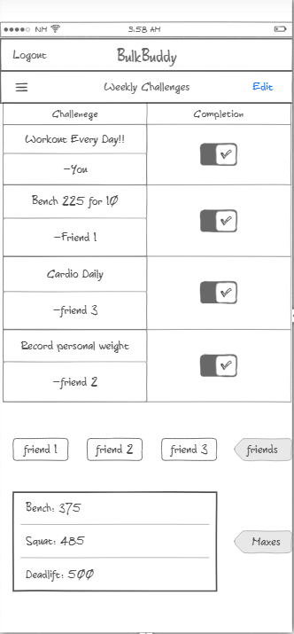

# BulkBuddy
This application serves as an online fitness community, with the purpose of tracking progress, setting challenges and comparing your progress and stats with your friends.  
## Specification Deliverable
### Elevator Pitch 
Going to the gym with friends is the best when your trying to make progress, but what if your schedules dont line up? BulkBuddy lets you create and join personalized weightlifting challenges, track your lifting progress, and connect with your lifting community. Its the best way to bulk up your lifting experience – where challenges are fun, progress is shared, and gains are celebrated!
### Design

### Key Features 
* Secure login.
* Create challenges for your friends and yourself.
* Display personal maxes.
* Ability to view friends maxes and progress.
* Progress section to see weekly growth.
* Results and progress is persistantly stored.
### Technologies
* HTML and CSS - Create the user interface. Design the layout, buttons, and overall presentation of pages offered in the app (login, home, friends).
* JavaScript - Implement the behavior of the application. This includes handling user interactions, updating the UI in real-time, and sending/receiving data to/from the server.
* Service - Create a backend service using a server-side technology, with endpoints for logging in, retrieving progress and max stats, as well as challenges given by users.
* Websocket - Enable real-time communication between the server and clients. This is crucial for updating the UI in real-time as stats are recorded.
* React - Builds front end components, allowing a better user interface, with updates recieved through websockets. 

## HTML Deliverable
I worked on the application structure and some of the formatting for this deliverable.
* **HTML pages** - 4 html pages, one for the login, one for the home, one for viewing friends scores, and one for seeing challenges.
* **Links** - There is a nav menu when logged in that will take you to two separte pages for friends and challenges.
* **Text** - Descriptions of your maxes as well as your frineds are outlined in text, which are editable, and same with the challenges set.
* **Images** - I added an image of a dumbbell to the front page to show an idea of the icon.
* **Login** - Input box and login button for this.
* **Database** - Collection of users maxes that can be displayed as friends. 
* **Websocket** - real time updating for challenges set and challenges made.

## CSS Deliverable 
I worked on the styling I put in place during the HTML deliverable. This is a more final form of how I want my application to look. I split the work I had done before, off of the index.html and made its own css file that is used by link.

* **Navigation elements** - Fixed the coloring on my various navigation bars, and I made the login box circular. 
* **Responsive to window resizing** - Looks good on all devices and all sizes of screen.
* **Application elements** - made it very simple but effective in holding attention. 
* **Application text content** - I changed my overall font, sizing and some spacing as well, to achieve a more custom feel.
* **Application images** - I made sure my images would blend well in the background, and not cover anything up.
